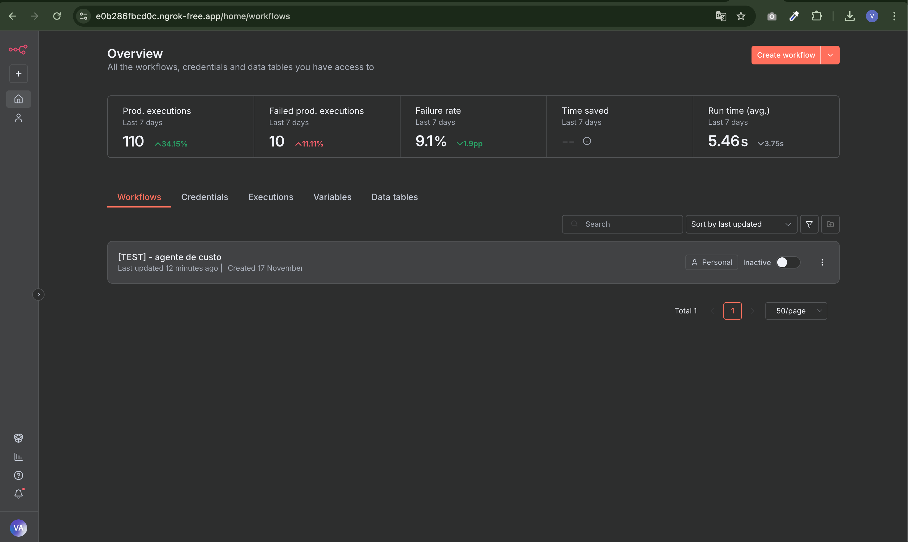
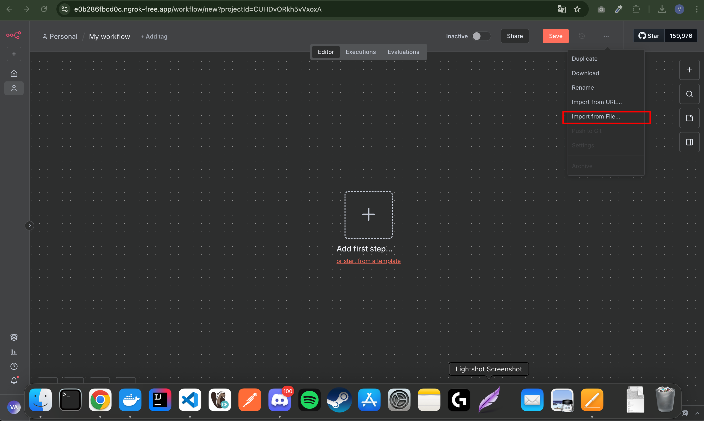
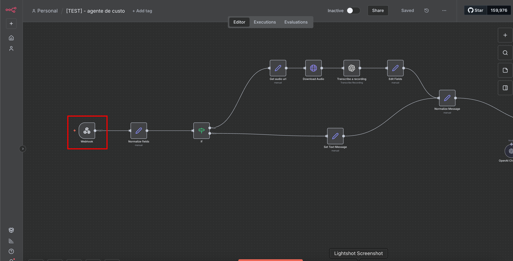
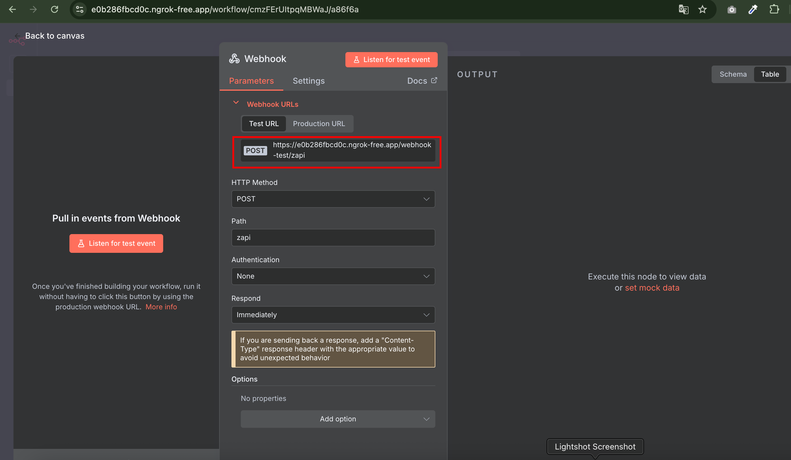
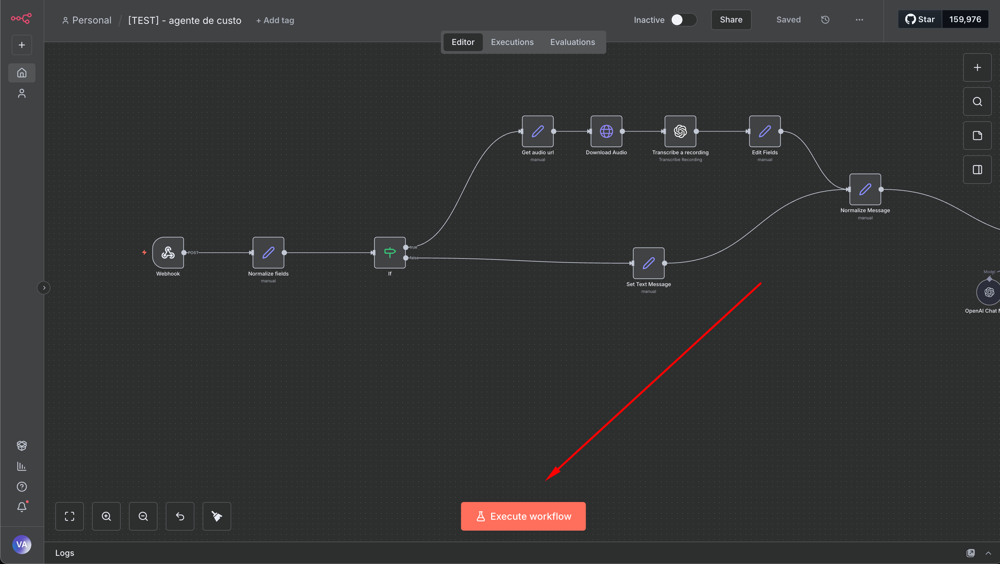
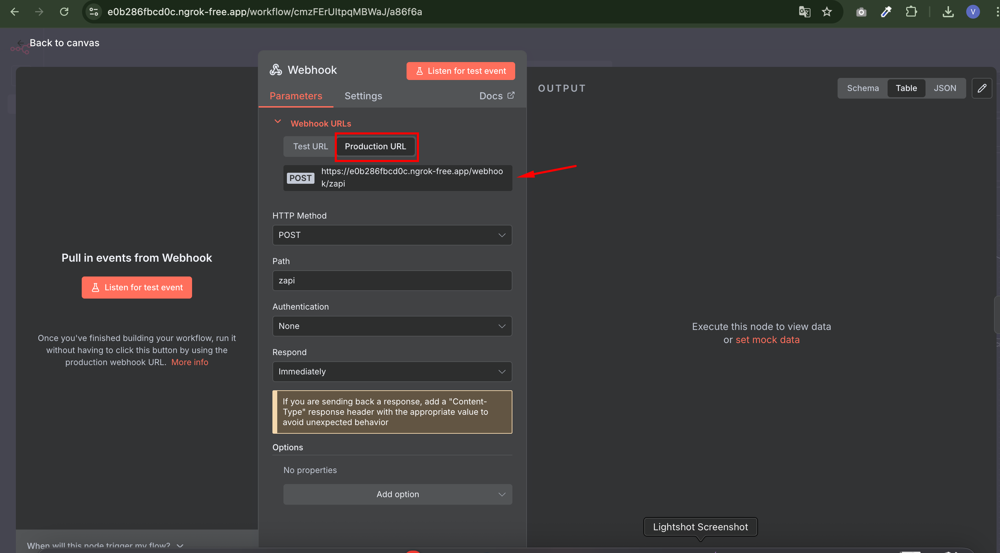
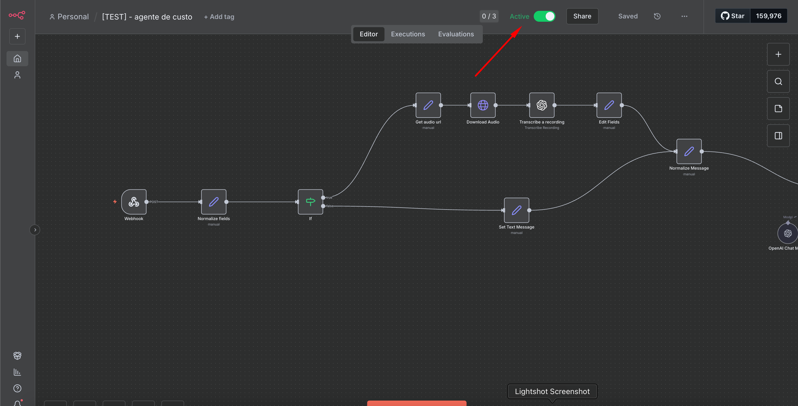
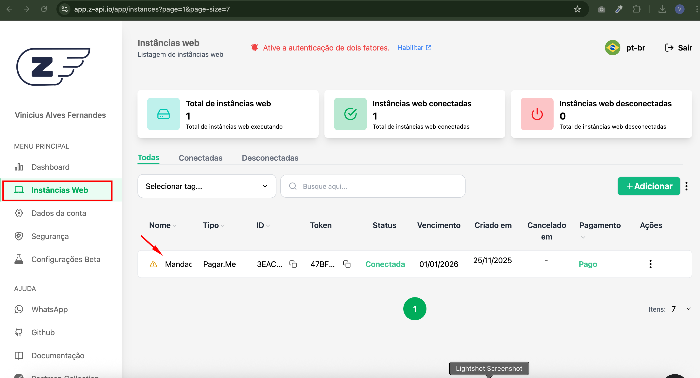
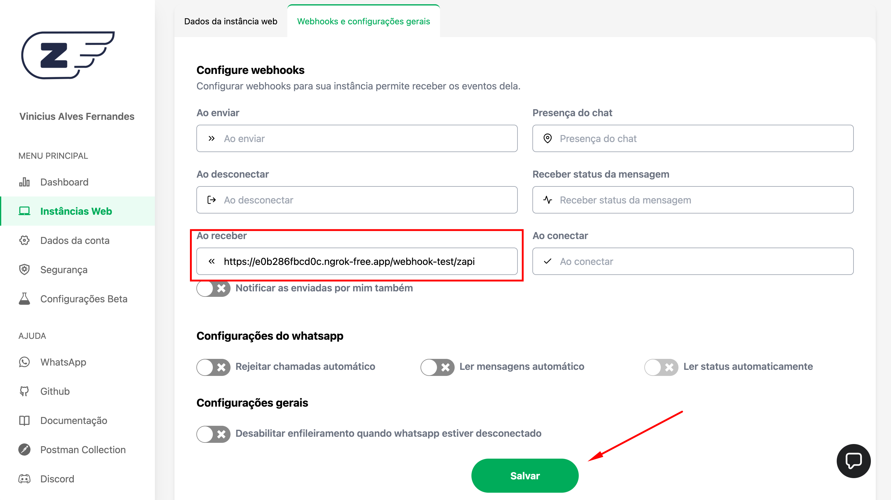

# Execuando a aplicação

### 1 - Suba o ngrok apontando para a porta 5678 (N8N)

```bash
    ngrok http 5678
```

### 2 - Ajustando o docker compose do n8n

Copie a URL gerada pelo ngrok e substitua na variável WEBHOOK_URL do container do N8N no docker-compose.yml.

Exemplo abaixo:

```yml
    n8n:
    image: n8nio/n8n:latest
    container_name: financial-n8n
    platform: linux/amd64
    environment:
      WEBHOOK_URL: https://e0b286fbcd0c.ngrok-free.app #Aqui deve ficar a URL gerada pelo ngrok
      N8N_HOST: host.docker.internal
      GENERIC_TIMEZONE: America/Sao_Paulo
      N8N_LOG_LEVEL: debug
      N8N_COMMUNITY_PACKAGES_ALLOW_TOOL_USAGE: true
    volumes:
      - n8n_data:/home/node/.n8n
    ports:
      - "5678:5678"
```

Feito isso, subir o docker compose

```bash
    docker compose up -d
```

### 3 - Acessando e Configurando o N8N

#### 3.1 Copie a URL gerada pelo ngrok no navegador, e clique em "Create workflow"



#### 3.2 importe o arquivo zapi-flux.json



### 4 - Conecatando o ZAPI

#### 4.1 Para utilizar o fluxo em mode de teste, copie a URL de teste







#### 4.1.1 Para utilizar o fluxo em modo produção, copie a URL de produção e ative a aplicação para ser disponibilizada





#### 4.2 Faça login no Zapi, acesse a instância e cole a URL do Webhook do N8N, pode ser a [URL de teste](#41-para-utilizar-o-fluxo-em-mode-de-teste-copie-a-url-de-teste) ou [URL de produção](#411-para-utilizar-o-fluxo-em-modo-produção-copie-a-url-de-produção-e-ative-a-aplicação-para-ser-disponibilizada)






